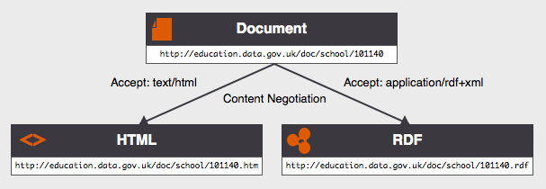

# How to publish Open Data on the Web
There is an increasing interest towards publishing data open on the Web. 
Opening what used to be closed data brings a lots of opportunities in terms of 
social and economical development, participatory governance and improvement of 
research processes. Although the motivation is clear the publication is in 
practice open to a lot of different options. Even for one motivated in 
publishing his data online, it remains still unclear _how_ to do it. This 
chapter discusses the wide range of data publication approaches and pays a 
particular attention to the Linked Open Data publication principles advocated 
by the W3C.

## Publishing Open Data
According to the site <http://opendefinition.org>, Open Data is "A piece of data or content is open if anyone is free to use, reuse, and redistribute it — subject only, at most, to the requirement to attribute and/or share-alike." [OpenDefinition]. This implies no specific way to publish the data, it also gives no clear definition as to what _data_ is. Both points are left up to the discretion of the data publisher.

In order to share his open data on the Web, a publisher will first make his data ready and then put it somewhere where it can be found and downloaded.

### Get the data ready
A first option for publishing data is the so called "CSV" file. This simple and intuitive format defines a table with rows as data entries and columns as properties for the entries. The first row is typically used to indicate what the column contain and the first column is typically used as the identifier of the entry. Comas or tabs can be used to separate the cells, leading to Coma Separated Values document (CSV) in the former case and Tabular Separated Values document (TSV) in the later. Such documents can be opened by any spreadsheet software for easy manual manipulation and can also be parsed by most popular data processing software.

The main drawback of CSV documents is that their semantics is very poor - if not inexistent. The Simple Data Format [SDF] proposed by the OpenKnowledge Foundation is a way to tackle this by associating a JSON document to the raw CSV data. This additional document describes the type of the columns and provide some other meta data that make it easier to consume the CSV data. A similar approach can be found in the Data Set Publishing Language [DSPL] from Google. A DSPL package contains a CSV file with the raw data and an associated extended description of the content in an XML file. Both SDF and DSPL are two good approaches to keep the CSV file as is and provide the necessary meta-data next to it, with the goal of making these CSV files easier to reuse by adding more information related to their semantics. 

Once the data is ready to be published, either as a CSV or a bundle CSV+Semantics, the next step consists in putting it "on the Web".

### Put it online
Since the advent of Web 2.0 that turned static Web sites into interactive publication platforms, it is now feasible to put anything on the Web in a matter of clicks. Filling in a form and attaching a file is all that it takes to share data on the Web. There are many platforms offering to store and serve open data (e.g. [DataVerse], [EASY] and [FigShare]) and portals to index the content of data sharing platforms that facilitate finding data on the Web (e.g. [DataHub], [DataCatalogs], [PublicData.eu]).   

Most of these tools offer some interesting features such as tagging of data sets, the attribution of unique identifiers and guaranteed digital preservation.

### Consume the data
Once the data has been packaged and put online two things happen: the data provider need to regularly update its deposit to ensure the data made available is timely and relevant. Data consumers download the data and then integrate it into their applications.

These two processes imply some extra work for both parties. The data publisher has to export his data into another format (there is hardly any information system that uses CSV as a native data backend) regularly and update the meta-data file when something changes in the export procedure. The data consumer also has to keep up with the updates and do some curation and integration work to bind together the CSV files he may harvest from different sources - this is where these meta-data documents provided in SDF and DSPL bundles turn out to be important. Data consumers are also likely to have to deal with a lot more data than the amount they actually need for their application (e.g. download data about all the cities in the Netherlands to make a mobile application used in a small - and unknown in advance - fraction of those places).

The answer to these issues lies in the providing of so called REST application programming interfaces. [ProgrammableWeb] references 5880 such APIs on the Web, out of a collection of 9256. Following this approach the data publisher make available an API that is connected to his data. Instead of, or in parallel to, providing dumps of the content of a given information systems, data consumers can query this content through a number calls similar to those found when dealing with libraries in any programming language. APIs also have the advantage of providing an easy way to control the access to the data. As an example, the API of [GeoNames] can be freely used for a small amount of requests but has to be paid for for bigger information needs. 

Offering an API and semantically annotated data dumps, along with a proper HTML page describing the data provided and the interaction with its API is currently recognised as a good practice satisfying both the need of data consumers and publishers. In this picture Linked Data stands as a way to unify the publication of the data to its semantics and to its API. Data published as Linked Data uses the Web as the API for accessing it and allows for the publication of both the raw data and its semantics within the same platform.    

## Publishing Linked Open Data
Publishing Linked Data boils down to using the Web as a plaform. It is publishing data _in_ the Web rather than _on_ the Web. For this reason, HTTP URIs similar to those used for Web documents are used to identify resources [DesignIssues]. The resources are most of the time equivalent to the data entries found in CSV documents (the rows of the files). When links are established among the different resources the data is said to be "5 stars" [FiveStarData]. Linked Open Data is commonly used to speak about Open Data published according to the Linked Data publication principles.

There exists many good references to get to know more about the publication of 5-star data and tools to make this happen. Some of these will be covered in other chapters of this book. In the following two sections we will focus on some basic aspects around the publication of Linked Data: provide de-referencable URIs to the resources and making additional APIs available to query the data.

### Create de-referencable resources
To get a grasp of what making de-referencable URI for resources means let us have a look at how DBpedia does it. DBpedia is a Linked Data data set which is composed from factual information extracted from Wikipedia. One part of this data contain information such as the mayor name and the population size of cities in the world. If that data would be published as CSV, this part of the data set would be one huge "cities.csv" with one city per row and all the information (mayor name, population size, ...) dispatched in as many columns. 

One such row would contain information about "Amsterdam" in the Netherlands. In DBpedia, Amsterdam gets the identifier "http://dbpedia.org/resource/Amsterdam" rather than an abstract code (e.g. "2759793") or a raw name (e.g. "Amsterdam"). 
The main drawback of using a code is that this code is unique only within a given information system. Collisions are expected to raise when several files using different internal attribution schemes are brought together. Raw names are most often too ambiguous to be meaningful. In the present case "Amsterdam" should be replaced by "Amsterdam, Netherlands" to bring more context but this may not be enough in all the cases as some city names are sometimes re-used across the same country. It must be noted URNs solve the problem of colliding code spaces but does not provide de-referencability directly. These URNs, such as DOI, have to be coupled with a de-referencing service to get to the resource and receive the information associated to it. Compared to abstract codes, raw names and URNs, the usage of HTTP URI provides both unique and de-referencable identifiers to data items.

The command line tool "curl" can very conveniently play the role of a software getting the data about Amsterdam. The following line asks for the RDF data about Amsterdam serialised in an XML file:

```bash
curl -I -L -H "Accept: application/rdf+xml" http://dbpedia.org/resource/Amsterdam
```

The answer from the server is that the description associated to this identifier
is located at another URI. That information is provided along with other useful 
information:

```bash
HTTP/1.1 303 See Other
Date: Mon, 07 Jan 2013 10:18:36 GMT
Content-Type: application/rdf+xml; qs=0.95
Content-Length: 0
Connection: keep-alive
Server: Virtuoso/06.04.3132 (Linux) x86_64-generic-linux-glibc212-64  VDB
Accept-Ranges: bytes
TCN: choice
Vary: negotiate,accept
Content-Location: /data/Amsterdam.xml
Link: <http://mementoarchive.lanl.gov/dbpedia/timegate/http://dbpedia.org/resource/Amsterdam>; rel="timegate"
Location: http://dbpedia.org/data/Amsterdam.xml
```

Following the link that has been indicated to it, curl will open the XML page 
and get the following associated information. Among all the data provided, there 
are a number of links to other serialisation formats for the RDF data (for
instance, N3) and also links to other encodings for the structured data (for
instance, JSON).

```bash
HTTP/1.1 200 OK
Date: Mon, 07 Jan 2013 10:18:37 GMT
Content-Type: application/rdf+xml; charset=UTF-8
Content-Length: 578553
Connection: keep-alive
Vary: Accept-Encoding
Server: Virtuoso/06.04.3132 (Linux) x86_64-generic-linux-glibc212-64  VDB
Accept-Ranges: bytes
Expires: Mon, 14 Jan 2013 10:18:36 GMT
Link: <http://dbpedia.org/data/Amsterdam.n3>; rel="alternate"; 
type="text/n3"; title="Structured Descriptor Document (N3/Turtle format)", 
<http://dbpedia.org/data/Amsterdam.json>; rel="alternate"; 
type="application/json"; title="Structured Descriptor Document (RDF/JSON format)", 
<http://dbpedia.org/data/Amsterdam.atom>; rel="alternate"; 
type="application/atom+xml"; title="OData (Atom+Feed format)", 
<http://dbpedia.org/data/Amsterdam.jsod>; rel="alternate";
type="application/odata+json"; title="OData (JSON format)", 
<http://dbpedia.org/page/Amsterdam>; rel="alternate";
type="text/html"; title="XHTML+RDFa", 
<http://dbpedia.org/resource/Amsterdam>; rel="http://xmlns.com/foaf/0.1/primaryTopic", 
<http://dbpedia.org/resource/Amsterdam>; rev="describedby", 
<http://mementoarchive.lanl.gov/dbpedia/timegate/http://dbpedia.org/data/Amsterdam.xml>; rel="timegate"
X-SPARQL-default-graph: http://dbpedia.org
```

What happens is that curl is asking for information about the resource and negotiates the type of content to be returned. This process is also depicted on the following picture from [UK]:



It is a good practice to add a suffix indicating the nature of the serialisation being returned (".rdf", ".n3", etc) and not to use any suffix for the name of the resource itself. All the different serialisations can be served at different locations, it is a perfectly valid approach to have them being served by different servers.
More information about the redirect "trick" and de-referencing to different formats can be found online. There are tools that can be used to take care of dereferencing the entities properly and do the redirect (e.g. [Pubby], [Pages], [D2RQ]).

### Provide additional APIs

http://data.ordnancesurvey.co.uk/datasets/os-linked-data


[OpenDefinition]: http://opendefinition.org/
[SDF]: http://www.dataprotocols.org/en/latest/simple-data-format.html
[DSPL]: https://developers.google.com/public-data/
[DataVerse]: http://thedata.org/
[EASY]: https://easy.dans.knaw.nl/ui/home
[FigShare]: http://figshare.com/
[DataHub]: http://datahub.io/
[DataCatalogs]: http://datacatalogs.org/
[PublicData.eu]: http://www.publicdata.eu/
[ProgrammableWeb]: http://www.programmableweb.com/
[GeoNames]: http://www.geonames.org/
[DesignIssues]: http://www.w3.org/DesignIssues/LinkedData.html
[FiveStarData]: http://5stardata.info/
[UK]: http://data.gov.uk/resources/uris
[Pubby]: http://wifo5-03.informatik.uni-mannheim.de/pubby/ 
[Pages]: http://csarven.ca/statistical-linked-dataspaces#linked-data-pages
[D2RQ]: http://d2rq.org/

