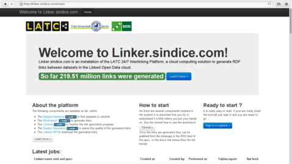
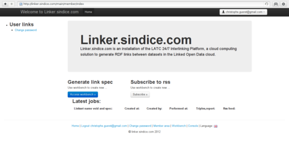
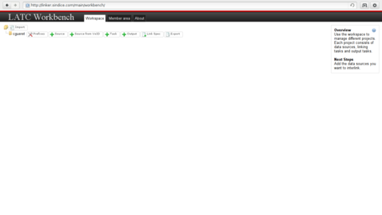
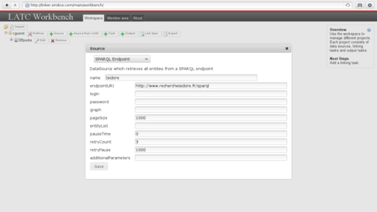
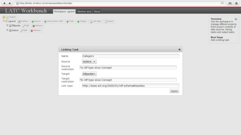
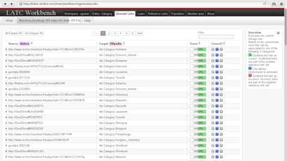

# How to: Linking resources from two datasets

## Why would one want to map datasets ?

## How can it be done ?
There are many tools that can be used to link resources across two datasets. Choosing one of them will depend on the type of resources you want to link and the preferences in term of interfaces.

### Mapping ontologies
There are many systems designed to establish mapping between concepts from ontologies, an overview of some of them can be found on the ontology matching web site [1]. 
When looking for a specific matcher it is interesting to look at the results of the Ontology Alignment Evaluation Initiative (OAEI) [2].
This competition is held yearly to benchmark different systems against a set of varied datasets.
The outcome is an overview of which matchers performs best on which type of dataset (among those that have been submitted to the benchmark).

### Mapping instances
In contrary to mapping ontologies, which involves aspects such as looking at the concept usages or their place in a tree, mapping instances is simpler. 
The problem typically consists in comparing the description of a resource with the description of another one and take a decision based on their similarity.
Considering a set of resources from a dataset "Source" and a set of resources from another dataset "Target", the comparison will be run on the cross-product of all resources from "Source" against all the resources from "Target".
There is again a variety of tools able to perform such comparisons. The Silk Link Discovery Framework (SILK) [3] and LInk discovery framework for MEtric Spaces (LIMES) [4] are two link discovery platforms that are doing all these comparisons in an optimised way. Both make use of tricks to prune the list of comparisons to make and shorten the processing time. They are provided with a graphical interface to parameter the software and they can be executed on desktop computers as well as servers running Hadoop.

An alternative is to generate the links manually if the URI are intuitive. For example, it is easy to guess the DBpedia resource associated to any Wikipedia page because they use the same identifiers, only the namespace changes.
This makes it possible to guess that the resource associated to Amsterdam is <http://nl.dbpedia.org/page/Amsterdam> because its Wikipedia page is <http://nl.wikipedia.org/wiki/Amsterdam>. Intuitive URIs are very convenient for developpers that can leverage them to generate links across datasets without having to use any linker software.

## Let's go!

The service <http://linker.sindice.com> provided by the semantic search engine is an hosted version of SILK that let everyone create links without having to install SiLK locally.
This is the reason why we will use this service in the remaining part of this chapter. Installing SiLK locally on a machine is not complicated though, we will come back to that a bit later.

As an example, we will connect the categories found in [Isidore] to those of [DBpedia].

### Get an account
The linker service can be found at <http://linker.sindice.com>, the home page at this address shows the number of links the platform generated so far and feeds for these links.
Anyone can subscribe to the feeds and get the links. The linking specifications hosted on the linker are re-executed on a regular basis in order to cope with changes made in the datasets they interlink.

A click on "Sign in or register" leads to a variety of services that can be used to get an account on the linker. Whereas the links can be accessed without being logged in, this step in mandatory in order to submit new linking specifications. 

The member area diplayed once logged in is a private space with data related to the connected user. From that space it is possible to see the result of the execution of the linking specifications.
There is also a link to the workbench on which we will click next.

Although the linking specifications are created in XML using the SiLK notation, you will not have to start your favorite XML editor. SiLK comes with a workspace that facilitates the creation of these specification with a simple drag and drop mechanism. A click on the "Access workbench" button from the linker gets you to that workspace. It is relevant here to say that if SiLK is ran locally the exactly same workspace is provided. Everything that follows can thus be tested on the linker site as well as on any other machine.

You're ready to go!

### Identify what to link
Before editing the linking specification let us step back to the datasets.
It is necessary to identify what will be linked.

<http://www.rechercheisidore.fr/resource/10670/1.2gbtg3>

| Predicate | Object |
|:----------|:-------|
| [rdf:type] | <http://www.rechercheisidore.fr/class/BibliographicalResource> |
| [rdf:type] | <http://www.openarchives.org/ore/terms/Aggregation> |
| [dcterms:language](http://purl.org/dc/terms/language) | http://lexvo.org/id/iso639-3/eng |
| [ore:similarTo](http://www.openarchives.org/ore/terms/similarTo) | ID:REGARDS:63389 |
| [dcterms:provenance](http://purl.org/dc/terms/provenance) | http://www.regards.cnrs.fr |
| [dc:date](http://purl.org/dc/elements/1.1/date) | 2008 |
| [dcterms:date] | 2008-01-01T00:00:00+02:00 |
| [dcterms:date] | <http://www.archivesdefrance.culture.gouv.fr/gerer/classement/normes-outils/thesaurus/T4-46> |
| [dc:type](http://purl.org/dc/elements/1.1/type) | Article |
| [sioc:topic] | <http://www.rechercheisidore.fr/subject/SHS:SCIPO> |
| [sioc:topic] | <http://www.rechercheisidore.fr/subject/SHS:SOCIO> |
| [sioc:topic] | <http://www.rechercheisidore.fr/subject/SHS:ECO>   |
| [dc:language](http://purl.org/dc/elements/1.1/language) | Anglais |
| [dc:source](http://purl.org/dc/elements/1.1/source) | Contemporary (The) Pacific |
| [dcterms:coverage](http://purl.org/dc/terms/coverage) | <http://sws.geonames.org/4034749/> |
| [ore:aggregates](http://www.openarchives.org/ore/terms/aggregates) | <http://regards.in2p3.fr/fiche.php?id=63389> |
| [dcterms:identifier](http://purl.org/dc/terms/identifier) | 10670/1.2gbtg3 |
| [dcterms:identifier](http://purl.org/dc/terms/identifier) | <http://regards.in2p3.fr/fiche.php?id=63389> |
| [dcterms:title](http://purl.org/dc/terms/title) | Wallis and Futuna. \[en ligne\]. Disponible sur Biblioshs |
| [dcterms:type](http://purl.org/dc/terms/type) | <http://www.rechercheisidore.fr/ontology/art> |
| <http://www.rechercheisidore.fr/property/scope> | <http://www.rechercheisidore.fr/subject/secondaires> |
| [ore:isAggregatedBy](http://www.openarchives.org/ore/terms/isAggregatedBy) | <http://www.rechercheisidore.fr/resource/10670/2.i2m6vw> |

<http://www.rechercheisidore.fr/subject/SHS:ECO>

| Predicate | Object |
|:----------|:-------|
http://www.w3.org/1999/02/22-rdf-syntax-ns#type 	http://www.w3.org/2004/02/skos/core#Concept
http://www.w3.org/2004/02/skos/core#broader 	http://www.rechercheisidore.fr/subject/SHS
http://www.w3.org/2004/02/skos/core#inScheme 	http://www.rechercheisidore.fr/categorie
http://www.w3.org/2004/02/skos/core#prefLabel 	"Economies and finances"@en
http://www.w3.org/2004/02/skos/core#prefLabel 	"Economies et finances"@fr
http://www.w3.org/2004/02/skos/core#exactMatch 	http://calenda.revues.org/categories.rdf#categorie22

<http://dbpedia.org/resource/Category:Sociology>

| Predicate | Object |
|:----------|:-------|
http://www.w3.org/1999/02/22-rdf-syntax-ns#type 	http://www.w3.org/2004/02/skos/core#Concept
http://www.w3.org/2002/07/owl#sameAs 	http://ru.dbpedia.org/resource/Категория:Социология
http://www.w3.org/2002/07/owl#sameAs 	http://es.dbpedia.org/resource/Categoría:Sociología
http://www.w3.org/2002/07/owl#sameAs 	http://ja.dbpedia.org/resource/Category:社会学
http://www.w3.org/2002/07/owl#sameAs 	http://cs.dbpedia.org/resource/Kategorie:Sociologie
http://www.w3.org/2002/07/owl#sameAs 	http://pl.dbpedia.org/resource/Kategoria:Socjologia
http://www.w3.org/2002/07/owl#sameAs 	http://el.dbpedia.org/resource/Κατηγορία:Κοινωνιολογία
http://www.w3.org/2002/07/owl#sameAs 	http://it.dbpedia.org/resource/Categoria:Sociologia
http://www.w3.org/2002/07/owl#sameAs 	http://pt.dbpedia.org/resource/Categoria:Sociologia
http://www.w3.org/2002/07/owl#sameAs 	http://de.dbpedia.org/resource/Kategorie:Soziologie
http://www.w3.org/2002/07/owl#sameAs 	http://fr.dbpedia.org/resource/Catégorie:Sociologie
http://www.w3.org/2000/01/rdf-schema#label 	"Sociology"@en
http://www.w3.org/2004/02/skos/core#broader 	http://dbpedia.org/resource/Category:Interdisciplinary_fields
http://www.w3.org/2004/02/skos/core#broader 	http://dbpedia.org/resource/Category:Social_sciences
http://www.w3.org/2004/02/skos/core#broader 	http://dbpedia.org/resource/Category:Society
http://www.w3.org/2004/02/skos/core#prefLabel 	"Sociology"@en
http://www.w3.org/ns/prov#wasDerivedFrom 	http://en.wikipedia.org/wiki/Category:Sociology?oldid=489438713

<http://prefix.cc/dcterms>

<http://www.w3.org/2003/01/geo/wgs84_pos#long>

`?a/<http://rdfs.org/sioc/ns#topic>/<http://www.w3.org/2004/02/skos/core#prefLabel>[@lang='en']`

### Prepare the task

<http://www.w3.org/2000/01/rdf-schema#seeAlso>

### Edit the linkage rules

### Generate the links

[1]: http://www.ontologymatching.org/projects.html
[2]: http://oaei.ontologymatching.org/
[3]: http://www4.wiwiss.fu-berlin.de/bizer/silk/
[4]: http://aksw.org/Projects/LIMES.html
[Isidore]: http://www.rechercheisidore.fr/
[DBpedia]: http://dbpedia.org/About

[sioc:topic]: http://rdfs.org/sioc/ns#topic
[dcterms:date]: http://purl.org/dc/terms/date
[rdf:type]: http://www.w3.org/1999/02/22-rdf-syntax-ns#type

