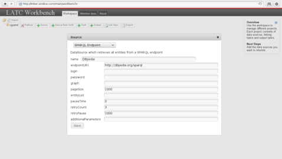
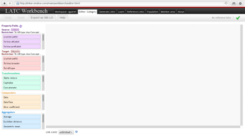
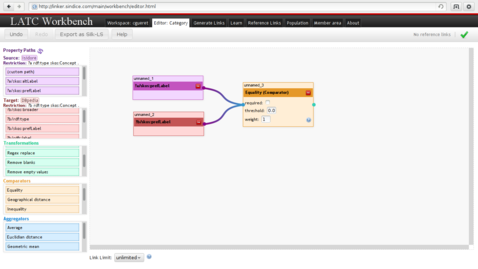
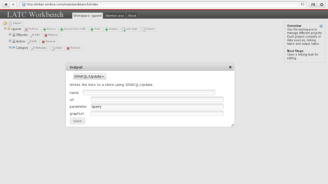

# How to: Linking resources from two datasets
The Linked Data publication principles define a way to share data while using the Web as a publication platform. Just like the Web is used to publish documents it can also be used to publish factual data. URIs are used to design resources with are described with property/values pairs and connected to other resources with typed links. These links between resources makes it possible to browse Linked Data and jump from resource to resource. They are also used to enrich datasets by connecting the resources with related datasets. But the best part is that _anyone_ can create and publish these links!

In this document we will describe how two relate resources from two public datasets using a tool called "SiLK". The links will be published by a third party which is the linker tool provided by the semantic search engine [Sindice](http://www.sindice.com).

## How to link datasets ?
There are many tools that can be used to link resources across two datasets. Choosing one of them will depend on the type of resources you want to link and the preferences in term of interfaces.

### Mapping ontologies
There are many systems designed to establish mapping between concepts from ontologies, an overview of some of them can be found on the ontology matching web site [1]. 
When looking for a specific matcher it is interesting to look at the results of the Ontology Alignment Evaluation Initiative (OAEI) [2].
This competition is held yearly to benchmark different systems against a set of varied datasets.
The outcome is an overview of which matchers performs best on which type of dataset (among those that have been submitted to the benchmark).

### Mapping instances
In contrary to mapping ontologies, which involves aspects such as looking at the concept usages or their place in a tree, mapping instances is simpler. 
The problem typically consists in comparing the description of a resource with the description of another one and take a decision based on their similarity.
Considering a set of resources from a dataset "Source" and a set of resources from another dataset "Target", the comparison will be run on the cross-product of all resources from "Source" against all the resources from "Target".
There is again a variety of tools able to perform such comparisons. The Silk Link Discovery Framework (SILK) [3] and LInk discovery framework for MEtric Spaces (LIMES) [4] are two link discovery platforms that are doing all these comparisons in an optimised way. Both make use of tricks to prune the list of comparisons to make and shorten the processing time. They are provided with a graphical interface to parameter the software and they can be executed on desktop computers as well as servers running Hadoop.

An alternative is to generate the links manually if the URI are intuitive. For example, it is easy to guess the DBpedia resource associated to any Wikipedia page because they use the same identifiers, only the namespace changes.
This makes it possible to guess that the resource associated to Amsterdam is <http://nl.dbpedia.org/page/Amsterdam> because its Wikipedia page is <http://nl.wikipedia.org/wiki/Amsterdam>. Intuitive URIs are very convenient for developpers that can leverage them to generate links across datasets without having to use any linker software.

## Let's go!

The service <http://linker.sindice.com> provided by the semantic search engine is an hosted version of SILK that let everyone create links without having to install SiLK locally.
This is the reason why we will use this service in the remaining part of this chapter. Installing SiLK locally on a machine is not complicated though, we will come back to that a bit later.

As an example, we will connect the categories found in [Isidore] to those of [DBpedia].

### Get an account
The linker service can be found at <http://linker.sindice.com>, the home page at this address shows the number of links the platform generated so far and feeds for these links.
Anyone can subscribe to the feeds and get the links. The linking specifications hosted on the linker are re-executed on a regular basis in order to cope with changes made in the datasets they interlink.

A click on "Sign in or register" leads to a variety of services that can be used to get an account on the linker. Whereas the links can be accessed without being logged in, this step in mandatory in order to submit new linking specifications. 

The member area diplayed once logged in is a private space with data related to the connected user. From that space it is possible to see the result of the execution of the linking specifications.
There is also a link to the workbench on which we will click next.

Although the linking specifications are created in XML using the SiLK notation, you will not have to start your favorite XML editor. SiLK comes with a workspace that facilitates the creation of these specification with a simple drag and drop mechanism. A click on the "Access workbench" button from the linker gets you to that workspace. It is relevant here to say that if SiLK is ran locally the exactly same workspace is provided. Everything that follows can thus be tested on the linker site as well as on any other machine.

You're ready to go!

### Identify what to link
Before editing the linking specification let us step back to the datasets.
It is necessary to identify what will be linked. In Isidore, research documents are described in RDF with a number of properties related to their content.
The following table contains the description of the document <http://www.rechercheisidore.fr/resource/10670/1.2gbtg3>. In the predicate column all the URIs have been shortened using the prefix registered on <http://prefix.cc>.

| Predicate | Object |
|:----------|:-------|
| [rdf:type] | <http://www.rechercheisidore.fr/class/BibliographicalResource> |
| [rdf:type] | <http://www.openarchives.org/ore/terms/Aggregation> |
| [dcterms:language](http://purl.org/dc/terms/language) | <http://lexvo.org/id/iso639-3/eng> |
| [ore:similarTo](http://www.openarchives.org/ore/terms/similarTo) | "ID:REGARDS:63389" |
| [dcterms:provenance](http://purl.org/dc/terms/provenance) | <http://www.regards.cnrs.fr> |
| [dc:date](http://purl.org/dc/elements/1.1/date) | "2008" |
| [dcterms:date] | "2008-01-01T00:00:00+02:00" |
| [dcterms:date] | <http://www.archivesdefrance.culture.gouv.fr/gerer/classement/normes-outils/thesaurus/T4-46> |
| [dc:type](http://purl.org/dc/elements/1.1/type) | Article |
| [sioc:topic] | <http://www.rechercheisidore.fr/subject/SHS:SCIPO> |
| [sioc:topic] | <http://www.rechercheisidore.fr/subject/SHS:SOCIO> |
| [sioc:topic] | <http://www.rechercheisidore.fr/subject/SHS:ECO>   |
| [dc:language](http://purl.org/dc/elements/1.1/language) | "Anglais" |
| [dc:source](http://purl.org/dc/elements/1.1/source) | "Contemporary (The) Pacific" |
| [dcterms:coverage](http://purl.org/dc/terms/coverage) | <http://sws.geonames.org/4034749/> |
| [ore:aggregates](http://www.openarchives.org/ore/terms/aggregates) | <http://regards.in2p3.fr/fiche.php?id=63389> |
| [dcterms:identifier](http://purl.org/dc/terms/identifier) | "10670/1.2gbtg3" |
| [dcterms:identifier](http://purl.org/dc/terms/identifier) | <http://regards.in2p3.fr/fiche.php?id=63389> |
| [dcterms:title](http://purl.org/dc/terms/title) | "Wallis and Futuna. \[en ligne\]. Disponible sur Biblioshs" |
| [dcterms:type](http://purl.org/dc/terms/type) | <http://www.rechercheisidore.fr/ontology/art> |
| <http://www.rechercheisidore.fr/property/scope> | <http://www.rechercheisidore.fr/subject/secondaires> |
| [ore:isAggregatedBy](http://www.openarchives.org/ore/terms/isAggregatedBy) | <http://www.rechercheisidore.fr/resource/10670/2.i2m6vw> |

Among all these properties, we will focus on [sioc:topic]. The ontology [SiOC](http://sioc-project.org/) is designed to describe resources related to social networks.
It is said in the ontology documentation that the property topic defines "A topic of interest, linking to the appropriate URI, e.g. in the Open Directory Project or of a SKOS category.".
The following table shows the description of the topic <http://www.rechercheisidore.fr/subject/SHS:ECO>.

| Predicate | Object |
|:----------|:-------|
| [rdf:type] | 	[skos:Concept] |
| [skos:broader] | <http://www.rechercheisidore.fr/subject/SHS> |
| [skos:inScheme](http://www.w3.org/2004/02/skos/core#inScheme) | <http://www.rechercheisidore.fr/categorie> |
| [skos:prefLabel](http://www.w3.org/2004/02/skos/core#prefLabel) |	"Economies and finances"@en |
| [skos:prefLabel](http://www.w3.org/2004/02/skos/core#prefLabel) |	"Economies et finances"@fr |
| [skos:exactMatch](http://www.w3.org/2004/02/skos/core#exactMatch) | <http://calenda.revues.org/categories.rdf#categorie22> |

Wikipedia also defines a number of topics wiki pages can be associated to. A manual search on the topic "Sociology" allows to find the related DBpedia resource at <http://dbpedia.org/resource/Category:Sociology>. It description contains links to other concepts and links to the similar concept in different localised versions of DBpedia.

| Predicate    | Object |
|:-------------|:-------|
| [rdf:type]   | [skos:Concept] |
| [owl:sameAs] | <http://ru.dbpedia.org/resource/Категория:Социология> |
| [owl:sameAs] | <http://es.dbpedia.org/resource/Categoría:Sociología> |
| [owl:sameAs] | <http://ja.dbpedia.org/resource/Category:社会学> |
| [owl:sameAs] | <http://cs.dbpedia.org/resource/Kategorie:Sociologie> |
| [owl:sameAs] | <http://pl.dbpedia.org/resource/Kategoria:Socjologia> |
| [owl:sameAs] | <http://el.dbpedia.org/resource/Κατηγορία:Κοινωνιολογία> |
| [owl:sameAs] | <http://it.dbpedia.org/resource/Categoria:Sociologia> |
| [owl:sameAs] | <http://pt.dbpedia.org/resource/Categoria:Sociologia> |
| [owl:sameAs] | <http://de.dbpedia.org/resource/Kategorie:Soziologie> |
| [owl:sameAs] | <http://fr.dbpedia.org/resource/Catégorie:Sociologie> |
| [rdfs:label](http://www.w3.org/2000/01/rdf-schema#label) | "Sociology"@en |
| [skos:broader] | <http://dbpedia.org/resource/Category:Interdisciplinary_fields> |
| [skos:broader] | <http://dbpedia.org/resource/Category:Social_sciences> |
| [skos:broader] | <http://dbpedia.org/resource/Category:Society> |
| [skos:prefLabel](http://www.w3.org/2004/02/skos/core#prefLabel) |	"Sociology"@en |
| [prov:wasDerivedFrom](http://www.w3.org/ns/prov#wasDerivedFrom) |	<http://en.wikipedia.org/wiki/Category:Sociology?oldid=489438713> |

Our goal will be to establish connections between the topics defined in Isidore and those found in DBpedia.
The connection will be expressed using the [rdfs:seeAlso](http://www.w3.org/2000/01/rdf-schema#seeAlso) property, indicating that when looking at a topic on Isidore more information could be found about this resource by looking at the resource pointed to in DBpedia.

Now that we know what we want to link and how it is time to start writing the linking task in SiLK.

### Prepare the task

The first thing to do is to add the two SPARQL end points for the datasets. DBpedia's can be found on `http://dbpedia.org/sparql`. Click on the `+ Source` button and fill in the form as follows:

Then proceed similarly to add Isidore's SPARQL end point located at `http://www.rechercheisidore.fr/sparql/` :

The next thing to click on is the button `+ Task`. The form is used to indicate what is the type of the resources that will be use as a source for the link and where to they come from, along with similar information for the target and the type of link. We want to connect instances from the class [skos:Concept]. This is the [rdf:type] of both of our example resources <http://www.rechercheisidore.fr/subject/SHS:ECO> and <http://dbpedia.org/resource/Category:Sociology>. When you are about to validate it, the form should have a content similar to this:

Once all these steps are completed the dashboard now contains two data sources and a linking task. The data sources can be re-used by many linking tasks, this is why they are declared spearately.
The next step consists in telling SiLK what to do exactly with the resources gathered from the source and target data sources. This will be done by editing the linkage rule.

### Edit the linkage rules

To open the linkage rule editor click on the button `Open` located next to the linkage task you want to edit. The editor open and starts to load the properties (this can take some time). Once everything is ready to go, the editor looks like this:

The first block on the left contains the list of properties used to describe the resources found in the source dataset. The box below it contains the properties of the resources in the target dataset. The come the transformation, comparison and aggregation operators. All those items are to be dragged and dropped from their boxes into the big canvas on the right. SiLK allows to establish very complex rules including string transformation and aggregation of several rules. For example, it is possible to say that a link can be created between a source A and a target B is the lower-cased label of A is similar enough to that of B and if their geographical position is the same with a marginal error of 100 meters. But for the sake of clarity we will hereafter compose something much simpler: take the property "prefLabel" from both the source and the target datasets, then drag and drop an equality comparison and connect its input to the two outputs of the "prefLabel" boxes:

This simple matching rule says that two resources can be connected only if their label is strictly equivalent. Now it is time to generate the links! 

### Generate the links

To make the linkage task run, click on the `Generate Links` tab and press the button `Start`. After a couple of seconds you will see your links starting to appear:

This interface has some advanced features to see which linkage rules have been triggered and mark some of the links as valid or not. It is a good idea to validate a couple of them so that the linker platform can warn you when those are not generated anymore. This could happen if one of the dataset goes offline or changes the way its resources are described. 

Now that the linkage rule is in place and that you verified it works you can close everything and just wait for Sindice to generate the links for you. These links will be made available on the homepage of the linker, along with all the other linkage tasks the platform uses. 

#### A note about local installation
When running SiLK locally on your machine you will have access to two other ways to get your links. The first one is to add an output file the link will be stored into. The second is to point SiLK to a SPARQL end point that supports update queries:

[1]: http://www.ontologymatching.org/projects.html
[2]: http://oaei.ontologymatching.org/
[3]: http://www4.wiwiss.fu-berlin.de/bizer/silk/
[4]: http://aksw.org/Projects/LIMES.html
[Isidore]: http://www.rechercheisidore.fr/
[DBpedia]: http://dbpedia.org/About

[sioc:topic]: http://rdfs.org/sioc/ns#topic
[dcterms:date]: http://purl.org/dc/terms/date
[rdf:type]: http://www.w3.org/1999/02/22-rdf-syntax-ns#type
[owl:sameAs]: http://www.w3.org/2002/07/owl#sameAs
[skos:broader]: http://www.w3.org/2004/02/skos/core#broader
[skos:Concept]: http://www.w3.org/2004/02/skos/core#Concept

